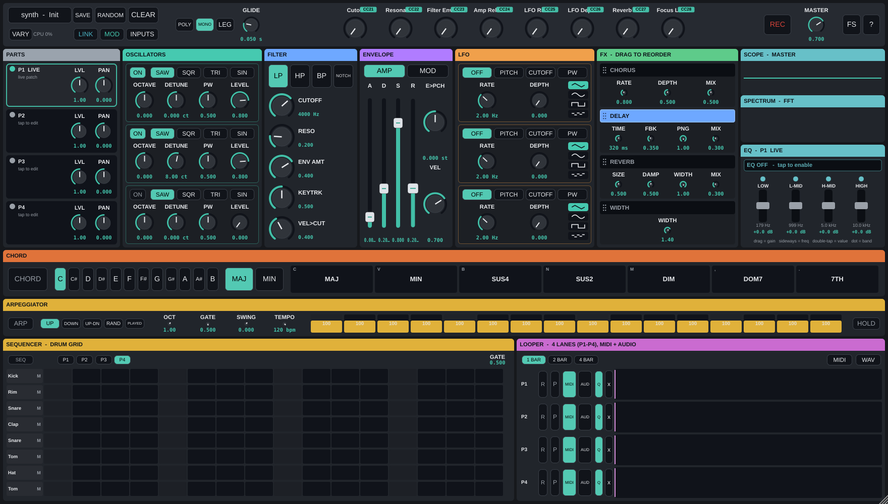

# synth

[](https://github.com/Sanglock81/synth/actions/workflows/build-test.yml)
[](https://github.com/Sanglock81/synth/actions/workflows/sanitize.yml)
[](LICENSE)

A hand-rolled **virtual analog polysynth**. C++17 / JUCE 8, built as a **VST3
plugin and a standalone app from the same code**, on **Linux and Windows**.

Designed for live play: Korg B2 (primary keyboard) + Novation Launchkey Mini
(secondary keys + mappable CC controller) → Focusrite Scarlett 2i2 out — but it's
a general-purpose synth that runs in any VST3 host or standalone.



## Features

- **3 anti-aliased oscillators** (PolyBLEP saw/square-PWM/tri/sine), 4× oversampled
  with a selectable Efficient/HQ quality-vs-CPU tradeoff, per-osc level + kill switch.
- **TPT state-variable filter** (LP/HP/BP/Notch), resonant and stable, with velocity
  and keytrack routing.
- **Two exponential ADSR envelopes** (amp + **mod env**), click-free retrigger and
  steal. The mod env drives the filter *and* **pitch** (`fltenv_to_pitch`, ±48 st) —
  the basis of the **drum** presets (808/punchy kicks, snare, hats, tom).
- **Three LFOs per part** (tri/sine/square/S&H) → pitch / cutoff / PW, plus pitch-bend,
  mod-wheel vibrato, and sustain-pedal handling.
- **Reorderable stereo FX** (per part): chorus, ping-pong delay, Freeverb-style reverb,
  mid/side width — drag to reorder, click-free crossfade — followed by a fixed **4-band
  parametric EQ at the end of each part's chain**. The EQ is a mixing-desk section that
  follows edit focus: a vertical gain slider per band (drag sideways = frequency,
  double-tap = numeric freq/gain/Q), per-band + section on/off. (The old global master EQ
  is retired — there is now one EQ concept, scoped per part.)
- **8 macros**, pre-assigned to musical defaults (cutoff, reso, filter-env, release, LFO
  rate/depth, reverb, focused-part level), routable to any parameter; Launchkey pots drive them.
- **Mod matrix** (per part, 8 slots): route any source (3 LFOs, mod/amp env, velocity, note,
  mod wheel, pitch bend, random, the 8 macros) to **any continuous parameter of the focused
  part** — a categorized registry of ~40 targets across Osc (pitch, PW, levels, octave/detune),
  Filter (cutoff, resonance, env-amt, keytrack, vel), Env (all ADSR stages + vel/amp), LFO
  (1–3 rate/depth), FX (chorus/delay/reverb/width — e.g. an LFO or Macro wobbling **delay
  feedback**), and per-part EQ gains. Combinations are just more slots (summed). The 5 classic
  per-voice targets keep full per-voice fidelity; block-level targets (FX/EQ/LFO/env) modulate
  at control rate. Wire routes by **touch-connect** — hit **LINK** (top bar), pick a source,
  then tap a glowing destination knob; drag it within ~2 s to set the depth in one gesture. The
  **MOD** overlay (categorized dropdowns, bipolar depth read-out, live-activity dots) inspects,
  re-points, inverts, re-depths, and deletes routes. Routes travel with the patch; the matrix is
  bit-identical passthrough when empty.
- **Bulletproof output stage**: voice-sum headroom trim + transparent safety
  soft-clip, so the output never clips the DAC on dense chords.
- **Diatonic chord engine**: one finger → an in-key chord (Major / Natural Minor,
  any root). Momentary, combinable, **MIDI-learnable** modifiers force the quality —
  MAJ/MIN/SUS4/SUS2/DIM/DOM7 and a diatonic 7TH — from the QWERTY bottom row, a
  footswitch (CC≥64), or a pad (a consumed note). A per-note ledger releases exactly
  the tones a chord triggered no matter how the modifiers churn while it's held.
- **Plug-and-play MIDI**: hot-plug auto-connect + JSON device profiles (Launchkey,
  Korg B2), MIDI-learn on every control (learned > user > factory precedence).
- **Full 4-part multitimbral**: part 0 is LIVE (what the panel edits), parts 1–3 are
  LOCKED — each with its **own** voice, FX chain, three LFOs, and mixer level/pan. Route
  each input surface (QWERTY, each MIDI controller) to a part in the **INPUTS** dialog
  (with key-range split zones), so a B2 can hold a bass part while a Launchkey plays the
  live patch. One shared 24-voice pool with full per-part isolation — a running generator
  never steals a note you play live. **MULTI** save/load recalls the whole layout.
- **Drum kit parts**: per-pad synth voices, choke groups, learn-by-play, per-pad editing
  (the full synth panel on any pad), factory kits + user `.kit` files.
- **Groove tools**: a diatonic **arpeggiator**, an 8-row **step sequencer** (dedicated
  drum grid), and a clock-linked **looper** (armed + measure-quantized, dual MIDI + AUDIO
  lanes, WAV export).
- **16 factory presets + 6 drums** + user save/load + sound-design Randomize. Loading a
  patch is **sound-only** — it never disturbs the sequencer, looper, tempo, or other parts.
  A default startup scene (P1 lead / P2 spare / P3 bass / P4 808 kit) is playable out of the box.
- **Standalone extras**: QWERTY computer-keyboard note input, curated audio-device
  default (PipeWire), F11 fullscreen, F12 live health overlay.
- **Observability**: RT-safe ring logger, per-block CPU/xrun/saturation telemetry,
  ASan/UBSan + soak, golden-render regression tests.

## Architecture

```
                    ┌────────────────────────────────────────────┐
 MIDI in ──────────▶│ processBlock                               │
 (Korg B2 +         │   ├─ note on/off ──▶ SynthEngine           │
  Launchkey, or     │   ├─ CC ───────────▶ MidiLearnManager ──┐  │
  DAW routing)      │   │                                     ▼  │
                    │   │                            APVTS params │
 GUI / DAW ────────▶│ APVTS ◀─────────────────────────────────┘  │
 automation         │   │ snapshot once per block                │
                    │   ▼                                        │
                    │ SynthEngine (16 voices, global LFO)        │
                    │   voice: OSC1+OSC2+OSC3+noise → SVF → VCA  │
                    │   per-source mix + kill  (TPT)  (2× ADSR)  │
                    │   (PolyBLEP)  velocity → amp & cutoff       │
                    │   ▼                                        │
                    │ mono → ×trim → stereo → FX → master → clip → out │
                    │   reorderable: chorus/delay/reverb/width   │
                    └────────────────────────────────────────────┘
```

Key rules baked into the design:

* **Audio thread is sacred.** `SynthEngine` and everything under `Source/DSP/`
  is allocation-free and lock-free. Parameters cross the thread boundary via
  APVTS atomics, snapshotted once per block into a POD `VoiceParams`.
* **Voices are dumb.** They hold DSP state only, never parameter state.
  All APVTS access lives in `PluginProcessor::snapshotParams()`.
* **MIDI is sample-accurate.** `processBlock` renders up to each event's
  sample position before dispatching it.
* **Parameter IDs are forever.** Once presets exist, never rename an ID in
  `Parameters.h` — add new ones instead. When a control's *meaning* changes, the
  old ID stays registered and a migration runs on load. The 2→3-oscillator move
  (6A) froze the old `osc_mix` crossfade and derives the new independent
  `osc{1,2,3}_level` faders from it, so pre-6A sessions **and saved presets** load
  sounding identical (see `migrateLegacyOscLevels` / `PresetManager::load`).

**Oscillators & mixer (6A).** Three PolyBLEP oscillators, each with its own
level fader and a hardware-style **kill switch** (an off oscillator is skipped
entirely — measurable CPU savings, not just muted). Velocity routes to amplitude
(`vel_to_amp`) and filter cutoff (`vel_to_cutoff`) for dynamic playing.

**Output gain staging.** A summing polysynth can drive its output far past
full-scale on dense chords (16 voices at unity ≈ several ×FS), which hard-clips
the DAC and sounds like crackle. Two stages keep it clean: a **fixed
`1/√maxVoices` headroom trim** at the voice sum (the equal-power rule for
quasi-uncorrelated sources — never a dynamic per-voice-count scale, which would
pump), and a **transparent safety soft-clipper** as the last stage after master
gain. The clipper is bit-exact below its 0.8 threshold (normal playing is
untouched) and gently saturates peaks above it, so the output **never exceeds
±1.0** for any patch or polyphony — a plugin-layer test enforces that invariant.
`Source/DSP/SoftClip.h`; clipper activity is logged (`clip=`) and shown as the
`SAT` line in the F12 overlay.

**Presets (6D).** 16 read-only factory patches spanning Bass / Lead / Keys / Pad /
Pluck / Brass / Strings / Winds / Organ / FX, plus **Init**, in a category-grouped
Load menu. Factory patches are embedded JSON (override-on-Init); tweak-and-Save
makes a user copy. Details in [docs/presets.md](docs/presets.md).

**Plug-and-play MIDI (6C).** In the standalone, plugging a controller in mid-session
auto-connects it, applies its **device profile** (default CC map), and toasts;
unplugging releases held notes. Profiles are JSON (factory profiles embedded for
the Launchkey Mini and Korg B2; user overrides in the config dir), with precedence
**learned > user > factory**. Full details in [docs/midi.md](docs/midi.md).

**Parts & input routing (7C).** The engine has up to **4 parts**. Part 0 = **LIVE**
(snapshots the APVTS each block — what the panel edits); parts 1–3 = **LOCKED**, each
holding a `VoiceParams` baked from a preset on the message thread and published to the
audio thread lock-free (double-buffer). Voices carry a part index at note-on and render
with that part's params via a single `paramsFor(part, note)` seam (the `note` arg is
unused in v1 — it's the seam a future per-note "Kit part" plugs into). One **shared**
16-voice pool with global oldest-steal. Each input **surface** (QWERTY, each MIDI input)
routes to a part in the **INPUTS** dialog; assigning a preset bakes it. In the standalone,
per-input MIDI capture replaces JUCE's device merge so each controller reaches its part
(no double-trigger). **v1 simplifications (deliberate):** the FX chain, global LFO,
poly-mode and master are **shared** and follow the LIVE part; a locked part contributes
only voice-level character (osc/mix/filter/env/vel/env→pitch). On-screen edits, Randomize
and the chord engine affect the LIVE part only.

**Full multitimbral (Sub-phase 2).** The v1 "shared FX / shared LFO" simplification is
retired: **each part owns its own FX chain and its own three LFOs**. A part renders into
its own buffer → its own chorus/delay/reverb/width → summed into the master, so you can
run a dry bass part next to a lead part drenched in delay + reverb. A part with no voices
and an idle FX chain is skipped entirely (the CPU control; a decaying reverb/delay tail
keeps processing until silent). Locked parts **bake** their FX + LFOs from their source
preset, so a locked part sounds exactly like loading that patch live. The panel edits the
LIVE part's three LFOs (LFO 1/2/3); `lfo2_*`/`lfo3_*` default off. Still shared across
parts: poly-mode, master gain, the safety clipper, and pitch-bend / mod-wheel (global
performance controllers). A **per-part mixer** (MIX section: `partN_level` 0–2, `partN_pan`)
balances the parts — level fixes the classic "kit too quiet under the lead", pan spreads
them across the stereo field. Pan uses a **0 dB-centre balance law** (`leftGain =
level·(pan≤0 ? 1 : 1−pan)`, right symmetric) so centre/unity is bit-identical to no mixer.
Mixer settings are MIDI-learnable and travel in a MULTI. Kit balance is two layers: the
part level here, plus each pad's own level in the Kit Editor.

**Key-range zones + routing lifecycle (Part B).** A surface isn't limited to one part —
each is an ordered, gapless list of **zones** tiling the keyboard `{loNote, hiNote, part,
transpose}` (default = one full-range LIVE zone). A note resolves to its zone's part and
is transposed by `transpose` semitones (the trigger is unchanged, clamped to MIDI); a
note-off releases exactly what its note-on triggered via a **ledger snapshot**, so
re-splitting mid-hold never strands a voice. Zone lookup sits at the routing seam — the
chord engine only sees notes that land on the LIVE part. QWERTY is a surface like any
other, so it's splittable too. The **routing lifecycle** is deliberately conservative:

- **Startup = clean.** On every launch each surface plays the LIVE patch, full range —
  routing/zones do **not** auto-restore. Only **sound** state (patch params, presets,
  MIDI-learn, FX order) persists.
- **Recall is explicit.** Save a **MULTI** (parts + splits + transposes + routing) and
  load it deliberately; that's the only thing that reapplies a layout. A zone whose
  part's preset is missing falls back to LIVE, logged.
- **Session-stable.** A configured surface keeps its assignment across an unplug/replug;
  the session ends when the app closes → back to the clean startup.

*Headline split:* bottom octave of a controller → **Part 1 / Kick 808** (a drum zone),
the rest → **LIVE** pad — one keyboard, two instruments by key range.

**Kit parts (Sub-phase 1).** A part can be a **Kit** — a 4×4 map of up to 16 pads, each
a trigger note → a baked source preset with its own **sounding note(s)** (1 = a hit,
2–4 = a tuned **chord pad**, pitch decoupled from the trigger), **level**, and **choke
group**. Choke is click-free (a closed hat silences an open hat in the same group);
re-hitting a pad retriggers it; an unmapped trigger is silent; note-off releases exactly
what the hit fired via a ledger. Per-pad params come through the same `paramsFor(part,
note)` seam the locked parts use. Click a locked part cell (P1–P3) on the PARTS strip to
open the **Kit Editor** (learn-by-play triggers/sounding notes, per-pad source/level/choke,
audition). Factory kits **808 Basics** and **Stab Board**; kits save/load and ride in a
MULTI. This turns a controller's bottom-octave drum zone into a real kit and its pads into
a trigger board. (v1: all pads of a Kit part share the part's one FX chain — per-part FX
comes next.) Full recipe + choke semantics in [docs/presets.md](docs/presets.md).

**Where the routing controls live (click-path).** Multitimbral setup is two visible
surfaces — a **PARTS strip** across the top of the editor and the **INPUTS** dialog it
opens:

1. Launch the standalone (see *Build & run* for the exact binary path) and look at the
   **top strip**: `PARTS  P0 LIVE | P1 -- | P2 -- | P3 --   [ INPUTS ]`. Each cell is a
   part; `--` means unassigned, a preset name means locked. Cells flicker when their part
   receives a note — a live proof-of-routing readout.
2. Click the teal **INPUTS** button at the strip's right end. The modal
   [INPUTS dialog](docs/inputs-dialog.png) lists every playing surface — **QWERTY** first,
   then each connected MIDI controller **by name** (each gets its own row).
3. On a surface's row, set the **route** dropdown (Live / Part 1 / Part 2 / Part 3). Pick a
   part and its **preset** dropdown enables — choose one and it's baked into that part.
4. To split by **key range**, press **SPLIT** on that row. A segmented bar appears; **+ Split**
   divides a zone, or **Split by play** arms the row so the next key you press sets the seam.
   Each zone has its own part, preset and transpose; **Reset surface** returns it to one
   full-range LIVE zone.
5. The **activity dot** on the left of each row blinks on incoming events, so a silent
   controller (dead cable, wrong USB port) is diagnosable without leaving the dialog.
6. To keep a layout, **Save MULTI** (the bottom bar notes it includes parts + splits +
   routing); **Load MULTI** reapplies it. **Reset all routing** clears everything back to
   default. Nothing here auto-saves — a relaunch always starts clean.
7. Close the dialog (Esc). Play that surface — its notes sound the assigned part/zone; the
   PARTS strip cell flickers. QWERTY plays the LIVE patch unless you routed or split it.

**Confirming you're on the current build.** If a control seems missing, first rule out a
stale binary: the startup log banner prints the git hash and build time, e.g.
`synth 0.x (git 1a2b3c4, built Jul  7 2026 23:14:12, Release) ... parts=4`. Compare the
hash against `git rev-parse --short HEAD`; if they differ you're running an old binary —
rebuild (*Build & run*). This banner was added precisely so "I don't see it" can be
separated from "it isn't there."

**FX chain (6B).** A global, **reorderable** stereo chain of four hand-rolled,
JUCE-free effects (all in `Source/DSP/`, allocation-free after `prepare`): chorus,
ping-pong delay, Freeverb-style reverb, and mid/side stereo width. Each block has
a kill toggle (disabled ⇒ skipped, no CPU) and rotary params. Drag the blocks in
the far-right FX panel to reorder them; the audio chain crossfades to the new
order click-free (~30 ms) via a dual-chain equal-power blend. The order is a
`fx_order` **state-tree property** (a permutation, not an automatable value),
mirrored to a lock-free atomic for the audio thread and saved with presets.

**Hear that order matters (10-second A/B).** Load **Init**; enable **Delay** and
**Reverb** only. Set delay feedback high (~0.8), delay mix ~0.5, reverb size large,
reverb mix ~0.5. Play one short stab and listen through the tail, then drag the two
blocks to swap them and play the same stab:
* **Delay → Reverb**: each delay repeat is fed into the reverb, so the echoes melt
  into one continuous wash.
* **Reverb → Delay**: the whole reverberated stab is delayed, so you hear distinct,
  echoing repeats of the reverb tail.
The difference is obvious by ear — that's the reorder working. (The four-block
permutation is regression-guarded by the `fx_nondefault` golden, which renders
delay→width→reverb→chorus.)

## File map

| File | What it is |
|---|---|
| `Source/Parameters.h` | Every parameter ID + APVTS layout. Single source of truth. |
| `Source/DSP/PolyBlepOscillator.h` | Anti-aliased saw/square(PWM)/tri/sine. The character. |
| `Source/DSP/SVFilter.h` | TPT state-variable filter (Simper/Cytomic). LP/HP/BP/Notch. |
| `Source/DSP/ADSREnvelope.h` | Exponential-segment ADSR with click-free retrigger + steal fade. |
| `Source/DSP/LFO.h` | Global control-rate LFO (tri/sine/square/S&H). |
| `Source/DSP/SynthVoice.h` | One voice's full signal chain. |
| `Source/DSP/SynthEngine.h` | Voice pool, oldest-note stealing, LFO routing. |
| `Source/DSP/Chorus.h` `StereoDelay.h` `Reverb.h` `StereoWidth.h` | The four hand-rolled stereo FX. |
| `Source/DSP/FXChain.h` | Reorderable FX chain + click-free reorder crossfade. |
| `Source/MidiLearnManager.h` | (channel, CC) → parameter mapping, with learned/user/factory precedence. |
| `Source/MidiProfile.h` | JSON device-profile parsing + factory/user library (see `resources/midi-profiles/`). |
| `Source/PluginProcessor.*` | JUCE seam: MIDI dispatch, param snapshot, render, state + legacy migration. |
| `Source/PluginEditor.*` | Hardware-style custom editor: signal-flow panel sections, touch faders. |
| `Source/UI/FXPanel.h` | Far-right FX column: rotary blocks with finger drag-reorder. |
| `Source/PresetManager.h` | User preset save/load (per-user dir) + musical randomize; migrates legacy patches. |
| `Source/FactoryPresets.h` | Read-only factory presets (JSON in `resources/presets/`, embedded). |

## Build

### Linux (Ubuntu/Debian)

```bash
sudo apt install build-essential cmake git \
    libasound2-dev libjack-jackd2-dev libfreetype-dev libfontconfig1-dev \
    libx11-dev libxrandr-dev libxinerama-dev libxcursor-dev libxext-dev \
    libcurl4-openssl-dev libwebkit2gtk-4.1-dev

cmake -B build -DCMAKE_BUILD_TYPE=Release
cmake --build build -j$(nproc)
```

Outputs:
* Standalone: `build/VASynth_artefacts/Release/Standalone/synth`
* VST3: `build/VASynth_artefacts/Release/VST3/` (auto-copied to `~/.vst3`)

### Windows

Visual Studio 2022 (Desktop C++ workload) + CMake. Same two commands from a
Developer Prompt. The standalone uses WASAPI/DirectSound by default; for
lowest latency into the Scarlett, load the VST3 in Ableton (ASIO) or add
ASIO SDK support later.

### First run (standalone, Linux)

1. Launch the standalone. By default it opens the **PipeWire/default output**,
   which follows your OS default sink — so it makes sound immediately, and if you
   set the **Scarlett 2i2** as the system output (or PipeWire sink), it plays
   there with no fiddling. The chosen device + the full available list are written
   to the log (`~/.config/synth/synth.log`).
2. To pick a specific device, open **Options → Audio/MIDI Settings**. The dialog
   still lists every raw ALSA endpoint (hw:/plughw:/front:/surround:/dmix…) as the
   advanced/show-all view; prefer the friendly `pipewire`/`default`/card names.
   Buffer 128–256 @ 48 kHz to start.
3. MIDI inputs (Korg B2, Launchkey Mini) **auto-connect** — plug them in before or
   after launch and they're enabled automatically (a device present at startup is
   now enabled, not just recognised). You can also toggle them in the dialog.
4. Play the Korg; twist Launchkey knobs (CC 21–28 pre-mapped: cutoff, reso,
   osc mix, env amt, attack, release, LFO rate, LFO depth).

### Laptop-only operation (no hardware)

**Audio device fallback.** The standalone's Audio/MIDI Settings offers device-type
selection (ALSA + JACK are compiled in) and any output including built-in laptop
audio. If a previously-selected device is gone at launch (Scarlett unplugged), it
falls back to the system default automatically — it won't crash or launch silent
(`selectDefaultDeviceOnFailure`). The dialog shows which device is active.

**QWERTY computer keyboard.** The standalone editor plays notes from the computer
keyboard — chromatic, one semitone per key, left to right (US layout):

```
  q w e r t y u i o p [ ]     C4 … B4   (MIDI 60–71)
  1 2 3 4 5 6 7 8 9 0 - =     C5 … B5   (MIDI 72–83)

  z / x  = octave shift down / up   (extends to the full range for bass patches)
```

Fixed velocity 0.8. OS auto-repeat is ignored (clean one note-on / one note-off
per press). Notes merge into the same engine path as hardware MIDI and coexist
with it. Keys are ignored while a text field is focused; all notes release when
the window loses focus (Alt-Tab) or closes — no stuck notes. Standalone only; in
a plugin the host owns the keyboard.

## Custom UI

Hardware-style single-surface panel (`docs/editor.png`), everything visible at once:
a **top bar** (preset · Save/Random · poly/mono/legato · glide · master · REC ·
fullscreen · help), a **MACRO strip** (M1–M8), a left **PART RAIL** (P1–P4 + level/
pan + INPUTS), the **centre** in signal-flow order (**Oscillators · Filter · Envelope
· LFO · FX**), a right **Scope + FFT + per-part EQ**, and a bottom **workstation**
(Chord bar · Rhythm arp+sequencer · Looper). Every control is bound to its APVTS
parameter via attachments (GUI ↔ automation ↔ MIDI-learn stay in sync); dark hardware
LookAndFeel; layout scales with the window.

- **MIDI-learn**: right-click (mouse) or long-press (touch) any control → arms it
  (amber pulse); the next CC binds it and a `CCnn` badge appears. Same gesture
  clears a mapping. The 8 Launchkey Mini pots (CC 21–28) map to **the 8 macros**
  (M1–M8) by default, and the macros ship pre-assigned (M1 cutoff, M2 reso, M3 filter-env,
  M4 amp release, M5 LFO rate, M6 LFO depth, M7 reverb, M8 focused-part level) — reassign
  any macro to a destination, or hit **Random**. If a controller's knobs end up driving the
  wrong things — or the macros point at the wrong destinations (a stale map from a past
  session) — **Reset MIDI + macros** in the INPUTS dialog restores both to factory
  (CC 21–28 → the macros, and M1 cutoff … M8 focused-part level).
- **Random** shuffles the **sound-design** parameters only (oscillators, filter,
  envelopes, LFO, FX amounts) and leaves your **performance** controls put — master
  gain, velocity routing, poly mode, glide, MIDI mappings, and the whole **rhythm
  section (arp / sequencer / looper / tempo)** all keep their values (single
  `randomizeExclusions()` list). It also assigns 1–4 macros to random destinations.
- **Live / touchscreen use — run fullscreen.** The FS button, **F11**, or the window
  title-bar's maximise button put the app in **kiosk mode**, which fills the screen and
  **removes the native title bar** — so a touch near the top of the window (e.g. a
  macro knob) can never be hijacked by the window manager as a window-move/edge gesture.
  Fullscreen is the recommended live mode; the macros live in the compact top bar
  alongside the preset selector and master.
- **Debug overlay**: F12. **Help**: `?` (Shift+/).
- QWERTY note input keeps working while twisting controls (controls refuse keyboard
  focus). VST3 uses the same editor, freely resizable.

## Observability (logging, health, debugging)

**Log file.** `~/.config/synth/synth.log` (JUCE default app-log location).
Each session appends a startup banner (version + git hash, build type, osc
quality, max voices, sample rate + buffer) and, from the standalone, the selected
audio device + type and enabled MIDI inputs (re-logged on device/MIDI changes).

**Audio-health stats.** Every ~10 s the log gets a line like:
```
render ms  min=0.05 med=0.37 p99=0.89 max=0.93 (16.7% budget)  voices<=6  steals=0  overruns=0  clip=0  dropped=0  n=3750
```
`p99 % budget` is the headline CPU number; **overruns** (a callback exceeding the
buffer period) are logged immediately as an xrun early-warning. Logging is
real-time-safe: the audio thread only pushes POD events into a lock-free ring; a
background thread formats and writes them (drops + counts if the ring floods,
never blocks the audio thread).

**Debug overlay.** Press **F12** in the editor for a live overlay: CPU %, voice
high-water, steals, overruns, the log-drop counter, and a **`SAT`** saturation-
activity line (amber + sample count when the output safety clipper is engaging,
dim when the output is clean).

**Sanitizer builds.**
```
./run-all-checks.sh --sanitize      # ASan+LSan then UBSan: tests + memory soak
```
Or manually: `cmake -B build-asan -DVASYNTH_ASAN=ON -DVASYNTH_BUILD_TESTS=ON`
(also `-DVASYNTH_UBSAN=ON`). The soak (`tests/soak`) runs a MIDI storm through
`processBlock` and checks memory stability; under ASan, LeakSanitizer gates leaks.

**Noise-cleanliness is a permanent regression criterion.** Any change that generates
notes or touches the audio path must ship, in the same commit, with click-torture
coverage of its behavior in `tests/plugin/test_click_torture.cpp` — it drives the full
processor and scans the stereo output for sample-to-sample discontinuities (clicks/pops),
out-of-range peaks, and non-finite samples. The `[click]` suite runs in every gate.

**Reporting a bug — please send:**
1. `~/.config/synth/synth.log` (has the banner, health stats, any OVERRUN /
   CRASH markers, and the log-drop count).
2. What you were doing (patch, polyphony, which keyboard/controller).
3. Audio settings (device, sample rate, buffer) — visible in Options → Audio/MIDI
   Settings and logged in the banner.

## Roadmap

**v1.0.0 — shipped.** See [CHANGELOG.md](CHANGELOG.md) for the full feature list. Highlights:
- [x] 4× oversampled PolyBLEP oscillators (Efficient/HQ), TPT filter, dual ADSRs, mod-env→pitch
- [x] Pitch bend + mod wheel + sustain pedal; mono/legato + glide; per-block smoothing
- [x] Full 4-part multitimbral (per-part FX + 3 LFOs + mixer) with per-part isolation; 24 voices
- [x] Drum kit parts (per-pad editing, choke); chord engine; arp + step sequencer; looper
- [x] Master parametric EQ; 8 routable macros; custom touch-reliable editor; default scene
- [x] Persist MIDI-learn mappings in APVTS state; MULTI layout save/load; sound-only patch load

**Deployment / validation (not yet done)**
- [ ] ThinkPad X1 Carbon 3rd gen (2015, dual-core Broadwell) is the live Linux
      machine: measure real round-trip MIDI-to-audio latency of the standalone
      under PipeWire at 128 samples / 48 kHz, and document recommended buffer
      settings (128 vs 256) for that machine. DSP headroom is benched
      (`tests/bench/dsp_bench`); this is the end-to-end I/O latency check.
      **This is also the real worst-case gate for the voice cap** (default 12):
      dev-box p99 is scheduler-jitter-contaminated, so confirm no xruns on the
      ThinkPad and adjust `VASYNTH_MAX_VOICES` if needed.

**Considered and deferred**
- Internal multi-core audio (splitting voices across RT worker threads): NOT
  done. Single-core Efficient at 12 voices is ~23% of the ThinkPad budget
  (median), and on a 2-core machine internal threading competes with PipeWire on
  core 1 and adds RT jitter. The DAW already parallelizes across instances.
  Revisit only if HQ-live or large unison is needed (v2, needs a lock-free pool).
- **Curated audio-device selector UI (backlog).** The just-works PipeWire default
  and curated device *logging* land now (`AudioDeviceCuration`), but the settings
  dialog still shows JUCE's raw ALSA list as the advanced view. Replacing it with a
  selector that shows only the curated list (friendly endpoints + card names, with
  a show-all toggle) needs a custom `AudioDeviceManager`/plugin-holder — deferred.

**v2 (make it deep)**
- [x] Mod matrix — any source → any continuous parameter (registry-driven), touch-connect LINK + categorized overlay
- [ ] Second LFO, per-voice LFO option, MIDI-clock sync
- [ ] Unison/detune stacking, hard sync osc2→osc1
- [ ] Sub-oscillator, filter drive/saturation
- [ ] Custom GUI with right-click MIDI-learn
- [ ] Preset browser

**Reference reading (open source to study, not copy blindly)**
- amsynth — closest architectural sibling, small and readable (GPL)
- Surge XT — filter algorithms (`sst-filters` is a reusable library), MSEG
- JUCE examples — `AudioPluginDemo` for processor patterns

## License

**synth is licensed under the GNU Affero General Public License v3.0** (see
[LICENSE](LICENSE)). This is a deliberate, required choice: the project builds on
**JUCE 8** under its free/personal terms, which permit closed-source distribution
only with a paid JUCE licence — otherwise the resulting software **must be released
under the AGPLv3**. As a free, open-source project we use AGPLv3 to match. In
practice: you may use, study, modify, and redistribute synth freely under the
AGPLv3, including the requirement to offer corresponding source for network-served
or distributed versions.

If you fork or redistribute, keep the AGPLv3 notice and provide source. If you want
to ship a closed-source product built on this code, you would need a commercial
JUCE licence and would still be bound by this project's AGPLv3 terms for the parts
derived from it.
