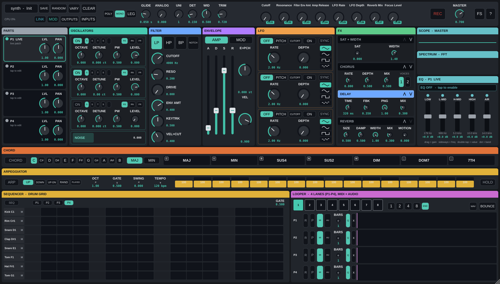

# Synth — a free, open-source virtual analog synthesizer

[](https://github.com/Sanglock81/synth/actions/workflows/build-test.yml)
[](LICENSE)

**Synth** is a multitimbral virtual-analog synthesizer: four independent parts (each its own
patch, FX, EQ and mixer channel), synthesized drum **kits** and **sample pads**, a step
**sequencer**, a per-part **looper**, launchable **scenes**, an 8-slot **mod matrix**, oscillator
**FM** and **wavetables**. It builds as a **VST3 plugin and a standalone app from the same code**,
for **Linux and Windows**. C++17 / JUCE 8.



---

## Install

### Tier 1 — Download (no building)

Grab the packaged build for your platform from the
**[Releases page](https://github.com/Sanglock81/synth/releases)** and unzip it.
Packaged releases begin at **v1.0.0**; until then, download the latest CI build from
**Actions → build-test → a green run → Artifacts** (`Synth-Linux` / `Synth-Windows`).

**Linux**
1. Unzip the archive.
2. Copy the `Synth.vst3` folder into your VST3 directory — `~/.vst3/` (create it if missing).
3. Run the standalone directly: `./Synth`
4. In your DAW, rescan plugins; **Synth** appears in the instrument list.

**Windows**
1. Unzip the archive.
2. Copy the `Synth.vst3` folder into `%COMMONPROGRAMFILES%\VST3\` (usually
   `C:\Program Files\Common Files\VST3\`).
3. Run `Synth.exe` for the standalone.
4. Rescan plugins in your DAW.

### Tier 2 — Build from source

**Linux — one command:**
```bash
git clone https://github.com/Sanglock81/synth.git
cd synth
./scripts/bootstrap-linux.sh        # installs deps, configures, builds Release
./tools/install-vst3.sh             # symlinks the VST3 into ~/.vst3 for your DAW
```
Artefacts land at:
- VST3 — `build/VASynth_artefacts/Release/VST3/Synth.vst3`
- Standalone — `build/VASynth_artefacts/Release/Standalone/Synth`

**Windows** (developers): install **Visual Studio Build Tools** (Desktop C++ workload), then from
a Developer Command Prompt:
```bat
cmake -B build -DCMAKE_BUILD_TYPE=Release
cmake --build build --config Release
```
The VST3 and `Synth.exe` land under `build\VASynth_artefacts\Release\`.
**Not a developer? Use Tier 1 above — no build tools needed.**

---

## Features

- **Four parts, multitimbral.** Each part has its own patch, 3-band **EQ**, per-part **FX**
  (saturation, chorus, delay, modulated reverb), level/pan, and its own voices.
- **Synth engine.** Three oscillators (saw / square / triangle / sine / **wavetable**) plus
  noise, through-zero **FM** (osc 3→2→1), a resonant filter with drivable self-oscillation, ADSR
  amp and mod envelopes, **unison**, and subtle per-voice analog drift.
- **Drum kits + sample pads.** Ten synthesized classic-machine kits, plus user **sample** pads,
  editable per pad.
- **Sequencer, looper, scenes.** An 8-row step sequencer, a per-part MIDI **and** audio **looper**
  (up to 16 bars per lane), and launchable **scenes** that switch patterns and loops on the beat.
- **Mod matrix.** Eight routing slots from LFOs, envelopes, velocity, note, macros and the mod
  wheel to any destination, with a touch-to-connect UI.
- **Tempo-synced LFOs**, host-tempo follow, and MIDI clock out.
- **VST3 + standalone**, Linux + Windows, from one codebase.

## Using it

- **Play it now.** Plug in any MIDI keyboard, or use the computer keyboard (**A W S E D…** as
  piano keys, **Z / X** to change octave). No controller required.
- **The built-in guide is the manual.** Click **?** in the top bar and pick any section for a
  spotlight, numbered markers, and a card explaining every control — *what* it does and *how* to
  use it. (Also generated to **[docs/guide.md](docs/guide.md)**.)
- **In a DAW.** Load **Synth** as a VST3 instrument on a track and play.
- **MIDI-learn.** Right-click (or long-press) any knob to arm learn, then move a hardware control
  to bind it; tap the knob again to cancel. Bindings are saved with your session.
- **Controllers.** Any MIDI controller works. Synth **ships with a controller profile for the
  Novation Launchkey Mini** — its knobs are pre-mapped to the eight macros and its pads to the
  drum surface; any other controller maps the same way via MIDI-learn. The synth is fully
  operable with **any** MIDI device, and with **none** (computer-keyboard only).

## Contributing

Issues and pull requests welcome. Build from source (Tier 2) and run the checks before a PR:
`./run-all-checks.sh` (build + tests + pluginval) and `./run-all-checks.sh --sanitize`
(ASan/UBSan + a memory soak).

## License

**Copyright © 2026 John L Farmer.**

**GNU AGPL v3** — see [LICENSE](LICENSE). The **source for every release is this repository**
(<https://github.com/Sanglock81/synth>); the AGPL's source-availability obligation is met
by that public repo.

Built with [JUCE](https://juce.com). **VST** is a trademark of Steinberg Media Technologies GmbH.

Factory presets and kits are provided as starting points; the sounds you make and share are yours.
